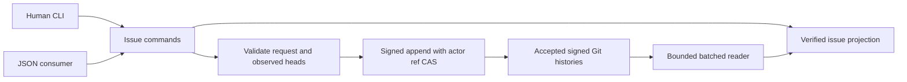

# Implementation Plan: Rich Issues and Reliable Automation

**Branch**: `feat/rich-issues-reliable-automation` | **Date**: 2026-09-09 | **Spec**: spec.md

## Summary
Extend signed issues with a full-state revision DAG, optional general-purpose structure and reliable machine operations. Keep the opening event as identity. Build a verified in-memory catalog using bounded batched Git reads. Preserve human commands and publish an additive JSON contract. Independent review identified replication dependency closure and actor-local CAS as critical boundaries; both are addressed explicitly below.

## Technical Context
**Language/Version**: Go 1.26, existing module hubnot and root package main.
**Primary Dependencies**: Go standard library and installed Git only; no dependency changes.
**Storage**: Existing signed actor histories under refs/hn; no new authoritative store or persistent issue cache.
**Testing**: Go behavioral/unit tests and subprocess CLI tests with temporary Git repositories/remotes; full race, vet, build and diff checks.
**Target Platform**: Existing Git-capable platforms; no platform-specific locking requirement.
**Project Type**: Single CLI application.
**Performance Goals**: 1000-issue verified read benchmark and equality against existing loader; constant count of batch object-reading processes, independent of event count.
**Constraints**: 256 KiB request input, 50 default / 200 max page records, bounded history/object ingestion; compatibility with legacy signed bytes.
**Scale/Scope**: Four implementation concerns, one issue domain, no Go Kitty adapter or Beads migration.

## Charter Check
HN-001 preserved: Git-native signed facts remain authority. HN-002/004: exact event IDs, immutable full-state successors and explicit conflicting heads. HN-003: bounded input/object reads, quarantine closure, no inferred execution permissions. HN-005: protocol/help/examples and tests ship together. Standard-library design, independent reviews, targeted commits and full regression gates retained. No charter exceptions or dependency supply-chain changes.

## Architecture and engineering alignment
The user delegated defaults and feature decisions. Rich fields are optional; a person can still open an issue by title. The current mission merges into its feature branch, with subsequent integration into main only after acceptance.

### Signed state and projection
Add optional `Issue *IssueState`, `Parents []string`, `Operation string`, `Request string`, `Intent string` fields at the END of Event with omitempty. Absent fields preserve current marshaling exactly. New `issue.revise` requires Subject=root, Parents sorted unique (1..200), Issue full state. Opening with Issue must match its Title/Body; legacy opening without Issue maps to title/body, status=open. Only issue kinds may carry issue/operation fields; unrelated event variants reject them. Comments reject Issue and Parents; openings reject Parents; revisions reject unrelated Title/Body fields. Intent is one of open/revise/resolve/close/reopen/comment and must match the signed event kind (close/reopen also bind the corresponding state status). New rich records use explicit shape/size validation without retroactively bounding legacy title/body records.

IssueState: title, body, status (open/closed), criteria [{id,text}], labels []string, assignees []string, relations [{kind,target}], metadata map[string]string. Domain-general string assignees are descriptive identities, not authorization. Criteria IDs unique per issue state, no acceptance authority. Bounds: title 1024 bytes; body 64 KiB; 64 criteria with id<=64,text<=4096; 64 labels/assignees <=256 each; 128 relations; 64 metadata pairs with namespaced key<=128,value<=4096; aggregate encoded new payload/request <=256 KiB. Define canonical sorting for set-like arrays and preserve criteria order. No duplicate links/labels/assignees. Namespace must contain a nonempty prefix and name separated by `/`; do not require an Internet domain.

`BuildIssueCatalog(events []StoredEvent) (*IssueCatalog,error)` is pure after event verification; validates roots, parent kinds, same-issue lineage, acyclic revision DAG, state shape and relation target availability. Compute maximal revisions independent of timestamp. IssueView includes id, creator, heads (id/actor/state), conflict bool, state pointer (nil when conflict), comments and history as indexed data. Empty arrays serialize as arrays in machine output. A relation graph aggregates links from all conflict heads with provenance and marks ambiguity; no readiness inference. Blocks and parent cycles are diagnostic, not a reason to discard valid concurrent signed facts. Local candidate mutations refuse cycles they introduce. Parent means source child -> target parent; blocks means source blocks target; related is displayed bidirectionally but signed on its source.

Integrate issue root/parent/relation dependencies in store relationship validation AND quarantine/shallow closure discovery. Missing dependencies must remain quarantined and produce existing actionable recovery diagnostics. Do not widen selection or promote unknown histories automatically. New kind must be covered by every closed-kind switch relevant to verification/replication.

### Verified batched reader
`collectIssueEvents() ([]StoredEvent,string,error)` snapshots accepted refs, validates names/pending admission, traverses deduplicated histories using one rev-list invocation and retrieves event.json/signature and any required run logs through bounded streaming cat-file --batch. Reuse signature, actor-chain and relationship validation, including attachment digests. Snapshot token binds sorted accepted ref names/OIDs. Re-read refs after loading and fail/retry boundedly if changed. No per-event subprocess and no global replacement of collectEvents in unrelated domains. Limit counts and byte sizes BEFORE allocation; return resource_limit rather than partial trusted results. Initial ceiling: 100000 events, 8 MiB per object, 256 MiB total; legacy records beyond reader budgets receive a diagnostic, not a reclassification as invalid signatures. Test corrupt/truncated/missing objects, pending refs, unrelated ref namespaces, signatures, attachments, and empty repositories. Process-count benchmark can wrap Git in a temporary PATH fixture; avoid global production instrumentation.

### Reliable writes
Implement a canonical IssueMutation input used by CLI. Full-state replacement operations: open, revise, resolve, comment. Request digest binds signed Intent, kind, subject, expected parents and canonical state/body; excludes transport timestamp, actor sequence and operation key, which is separately scoped to signer. Valid operation key <=128 printable non-whitespace ASCII bytes. Both operation and request digest are signed, all-or-neither. On replay, reconstruct semantic digest from signed content and validate it rather than trusting supplied digest. An identical operation returns its original event before current-head checks; changed content with the same key returns operation_conflict. Duplicate same-key records in admitted history require deterministic fail-closed diagnostics rather than an arbitrary replay winner.

Capture nextEvent (and therefore expected actor-head previous ID) BEFORE collecting/validating history. Then check replay and expected issue heads and append using that captured actor state. Concurrent same-actor writes cannot silently bypass a stale snapshot; CAS loser returns retryable concurrent_update without claiming success. If current actor head changed during the preflight, append fails. Already-observed stale issue heads fail with stale_revision. Another actor may advance after the snapshot: this is allowed and yields an explicit issue conflict after sync. This is snapshot preflight plus actor CAS, NOT global CAS. Do not automatically refresh expected heads/rebase a user's request. Replay after later changes still returns the original event.

### CLI contract
Keep existing issue commands; move issue implementation from commands.go into issue_commands.go and route from existing cmdIssue. Support:
- `hn issue open [--body TEXT] TITLE`, plus `--input FILE|- --operation KEY --json` rich form.
- `hn issue revise ISSUE --expect REV --input FILE|- [--operation KEY] [--json]`.
- `hn issue resolve ISSUE --expect REV ... --input FILE|- [--operation KEY] [--json]`. Default requires every observed head. Optional `--partial --snapshot TOKEN` consumes2..200 selected current heads under the exact observed ref-snapshot guard; remaining heads stay visible. This provides bounded staged recovery for arbitrarily many heads within reader budgets; a completed sequence converges to one head.
- `hn issue close|reopen ISSUE --expect REV [--operation KEY] [--json]` convenience full-state revisions. Replay matches signed Intent plus original subject/expected parent/operation key before deriving current state. Reuse the recorded state only for an identical convenience intent, then verify its canonical digest; changed intent or expectations fail.
- `hn issue comment ISSUE [--body TEXT] [TEXT] [--operation KEY] [--json]`.
- `hn issue list|show ISSUE|history ISSUE|graph ISSUE` with applicable `--json`, `--limit`, `--cursor`; list filters status/assignee/label optional if simple.

Flags follow existing before-title conventions; issue IDs precede per-subcommand flags. JSON input uses strict decoding with unknown/duplicate-field rejection and no trailing value. Provide a versioned envelope `schema: hn.issue/1`, `ok`, data or error(code,message), optional snapshot/next_cursor. Machine errors on stdout as one JSON envelope and nonzero exit; main may retain stderr error text unless it would expose hostile control characters. Never duplicate JSON errors. Stable codes: invalid_input, not_found, ambiguous_id, stale_revision, issue_conflict, operation_conflict, concurrent_update, stale_cursor, resource_limit, invalid_history, repository_error. Full IDs required for mutations; short unambiguous IDs allowed reads. Show bounds comments/history through separate pages; expose head states through a separately paginated `issue heads ISSUE` command; show returns head IDs bounded to its page and includes total count/conflict without silently truncating.

Cursor is opaque encoded version/snapshot/query hash/offset, validates range and matches exact query and snapshot. Stable ordering by full issue ID; history topological order with event ID tie-break, comments timestamp/ID; graph stable source/kind/target/provenance. No promises that a timestamp denotes causality. CLI tests govern exact finalized schema; update contract docs if implementation discovers a justified refinement.

## Project Structure
Core: event.go, store.go, quarantine.go, shallow.go, issue_model.go, issue_projection.go and focused new tests. Reader: issue_read.go, issue_read_test.go. CLI: commands.go, main.go, issue_commands.go, issue_commands_test.go. Acceptance/docs: issue_acceptance_test.go, examples/issue-consumer/, README.md, docs/issues-v1.md, docs/protocol-v0.md and docs/threat-model.md as present. Keep existing root package; no general framework extraction.

## Implementation Concern Map
### IC-01 — Signed issue state and replication closure
- Purpose: safe immutable revision model, pure projection and replicated dependency closure.
- Requirements: FR-001..006, FR-010, NFR-001, C-001..003.
- Surfaces: event.go, store.go, quarantine.go, shallow.go, issue_model.go, issue_projection.go and focused tests.
- Depends on: none. Risk: hidden closed-kind dispatch and legacy signed-byte compatibility.
### IC-02 — Bounded verified batch ingestion
- Purpose: reconstruct catalog inputs efficiently without another authority.
- Requirements: FR-010, NFR-001..002, C-001,C-003.
- Surfaces: issue_read.go and issue_read_test.go.
- Depends on: none; use existing validators, which IC-01 extends without changing signatures.
- Risk: object size framing, quarantine pending state, ref-snapshot consistency.
### IC-03 — Human and machine issue operations
- Purpose: expose rich state, revision guards, replay, bounded navigation and stable diagnostics.
- Requirements: FR-001..009, FR-012, NFR-001, C-002,C-003.
- Surfaces: issue_commands.go, commands.go, main.go, issue_commands_test.go.
- Depends on: IC-01 and IC-02. Risk: replay-before-guard ordering and convenience-command request identity.
### IC-04 — Consumer acceptance and living documentation
- Purpose: prove public journeys and document general-purpose use and actual guarantees.
- Requirements: FR-001..012, NFR-001..003, C-001..003.
- Surfaces: issue_acceptance_test.go, examples/issue-consumer/, README.md, docs/issues-v1.md, docs/protocol-v0.md, docs/threat-model.md.
- Depends on: IC-03. Risk: tests must exercise real Git replication and public CLI, never fake acceptance authority.

## Validation and rollout
Test-first per concern. Each WP independently reviewed on a fixed commit. Integrated candidate runs full charter gate. Two-replica black-box coverage proves conflict preservation, closure quarantine/recovery and idempotent retry. Reader fixture reports1000issues duration/process counts with exact semantic equality. No migration rewrites old signed records. Old clients may reject the new event kind (forward compatibility is not promised); upgraded clients preserve existing histories. Rollback executable changes cannot erase new signed events; document this explicitly. Work remains on feature branch until all acceptance evidence exists.

## Review dispositions
All initial review findings accepted: replication closure, preflight-vs-global CAS, conditional legacy limits, attributed conflict graph, replay-before-guard ordering, and bounded snapshot-aware reads. Second pass changed design to sign explicit Intent, reject issue fields on wrong variants, and support staged partial reconciliation plus paginated head inspection. Partial resolution is deliberate and retains unconsumed heads; snapshot is a preflight guard, not global atomicity.
